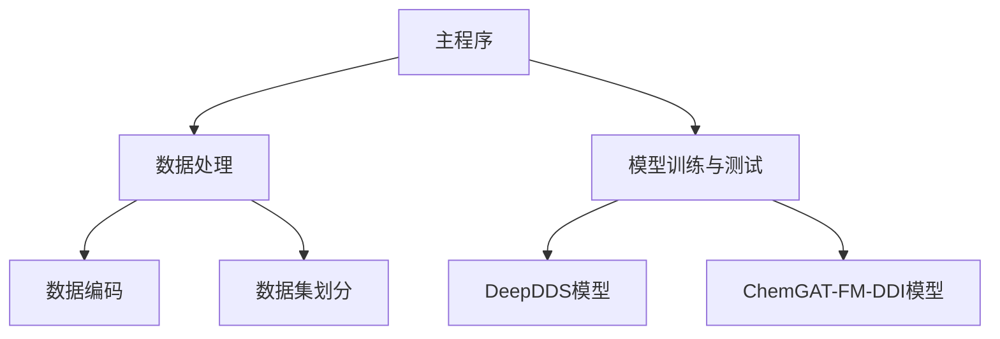

# Chemical-bond-enhanced Graph Attention and Factorization Machine Network for Drug Synergy Prediction

### 项目概述
本项目开发了一种基于化学键图注意力网络和因子分解机的药物组合协同效应预测，并实现了模型的训练和测试。可以同一数据集下对比该模型与基准模型DeepDDS的性能。

|模型|Acc|
|---|---|
|DeepDDS|81.50%|
|ChemGAT-FM-DDI|84.36%|


#### 系统架构


### 目录结构
```
.
├── checkpoints/          # 模型检查点
│   ├── dgl/              # DGL模型检查点
│   └── pyg/              # PyG模型检查点
├── data/                 # 原始数据存储
├── encodings/            # 处理后的数据编码
│   ├── dgl/              # DGL格式数据
│   └── pyg/              # PyG格式数据
├── models/               # 模型实现
│   ├── DeepDDS.py        # DeepDDS模型
│   ├── GAT.py            # ChemGAT模型
│   └── Model.py          # ChemGAT-FM-DDI
├── utils.py              # 数据处理工具
├── train.py              # 训练脚本
├── main.py               # 主入口文件
└── dataset.py            # 数据集处理
```

### 使用说明

#### 环境配置
```bash
pip install -r requirements.txt
```

#### 数据处理
```bash
python main.py --data
```

#### 模型训练
DeepDDS:
```bash
python main.py --model deepdds
```

ChemGAT-FM-DDI:
```bash
python main.py --model enhanced
```

#### 训练监控
- 可视化工具：Weights & Biases
- 检查点保存路径：./checkpoints/[框架类型]/
- 处理数据存储路径：./encodings/[框架类型]/

### 模型说明

#### ChemGAT
单层的ChemGAT结构如下所示。
##### 注意力系数计算
- 节点特征变换

$$z_i = f_{h}(h_i) = W_h h_i$$

其中 $z_i$ 是新的节点特征表示， $h$ 是输入特征，$f_{h}(\cdot)$ 表示全连接层等变换函数，等效于以一个增维矩阵 $W_h$ 乘以特征。

- 边特征变换
 
$$y_{ij} = f_{k}(k_{ij}) = W_kk_{ij} + b_k$$

其中 $y_{ij}$ 是新的节点特征表示， $k_{ij}$ 是输入的边特征， $f_{k}(\cdot)$ 表示全连接层等变换函数，等效于以一个增维矩阵 $W_k$ 乘以特征再加 $b_k$ 。

- 原始注意力计算

$$e_{ij} = a([y_{ij} \odot z_i || y_{ij} \odot z_j])$$

其中 $e_{ij}$ 是边 $(i,j)$ 的注意力权重， $a$ 是注意力计算函数， $y_{ij}$ 是边特征， $[z_i|| z_j]$ 表示节点 $i$ 和节点 $j$ 特征的拼接， $\odot$ 表示向量的哈达玛积。

- 原始注意力归一化

$$\alpha_{ij} = \frac{\exp(elu(e_{ij}))}{\sum_{k\in\mathcal{N}(j)}\exp(elu(e_{ik}))}$$

其中 $\alpha_{ij}$ 是归一化后的注意力权重，表示节点 $j$ 的邻居节点 $i$ 对节点 $j$ 的注意力贡献度。

##### 节点特征更新
- 特征聚合

$$h_j = \sum_{i\in\mathcal{N}(j)} \alpha_{ij} \cdot z_i$$

其中 $h_j$ 是节点 $j$ 更新后的特征表示，是将邻居节点的特征 $z_i$ 加权求和得到的。

